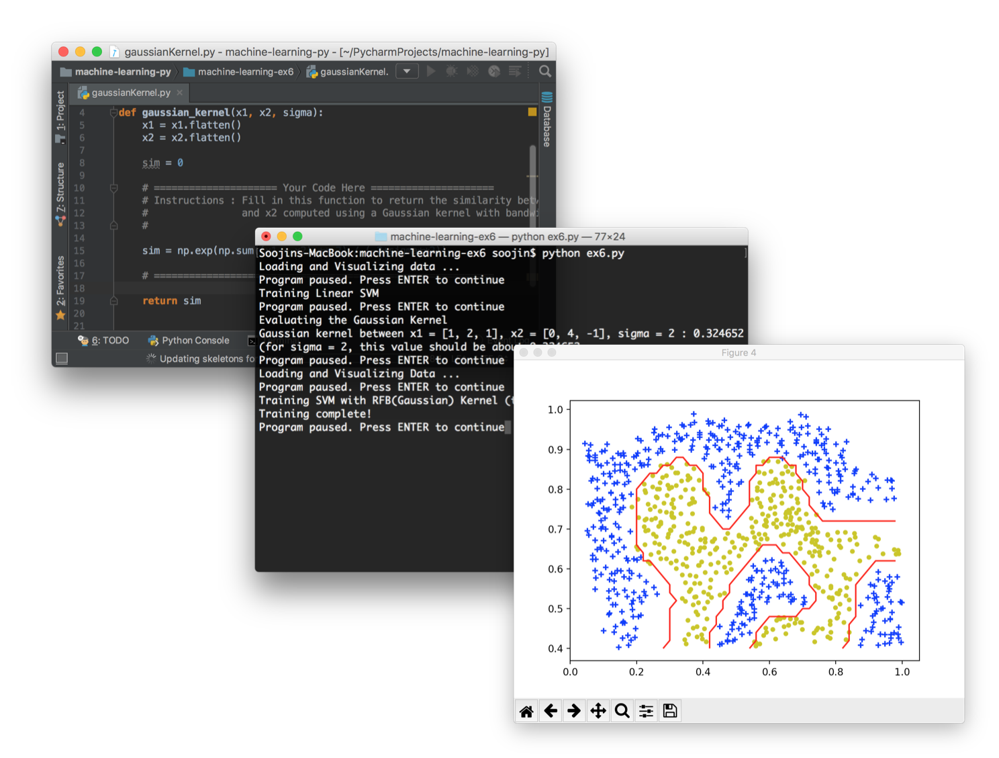

# 斯坦福机器学习作业（Andrew Ng）

   

# 徒手手工实现算法！！

## How to start
### Dependencies
This project was coded in Python 3.6
* numpy
* matplotlib
* scipy
* scikit-learn
* scikit-image
* nltk

### Installation
The fastest and easiest way to install all these dependencies at once is to use [Anaconda](https://www.continuum.io/downloads).

## Contents
#### [Exercise 1]
* Linear Regression
* Linear Regression with multiple variables
#### [Exercise 2]
* Logistic Regression
* Logistic Regression with Regularization
#### [Exercise 3]
* Multiclass Classification
* Neural Networks Prediction fuction
#### [Exercise 4]
* Neural Networks Learning
#### [Exercise 5]
* Regularized Linear Regression
* Bias vs. Variance
#### [Exercise 6](
* Support Vector Machines
* Spam email Classifier
#### [Exercise 7]
* K-means Clustering
* Principal Component Analysis
#### [Exercise 8]
* Anomaly Detection
* Recommender Systems

## Solutions
You can check out my implementation of the assignments [here](https://github.com/learning511/cs229-assignments/tree/master/Solutions). I tried to vectorize all the solutions.
